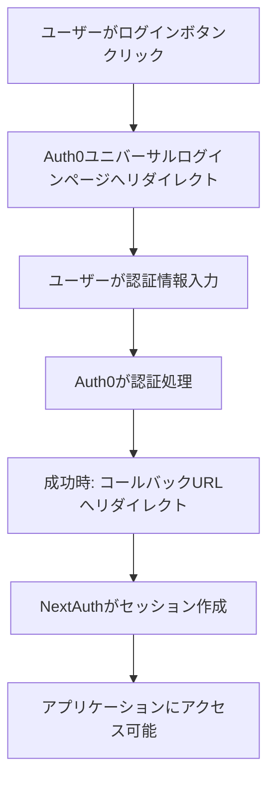
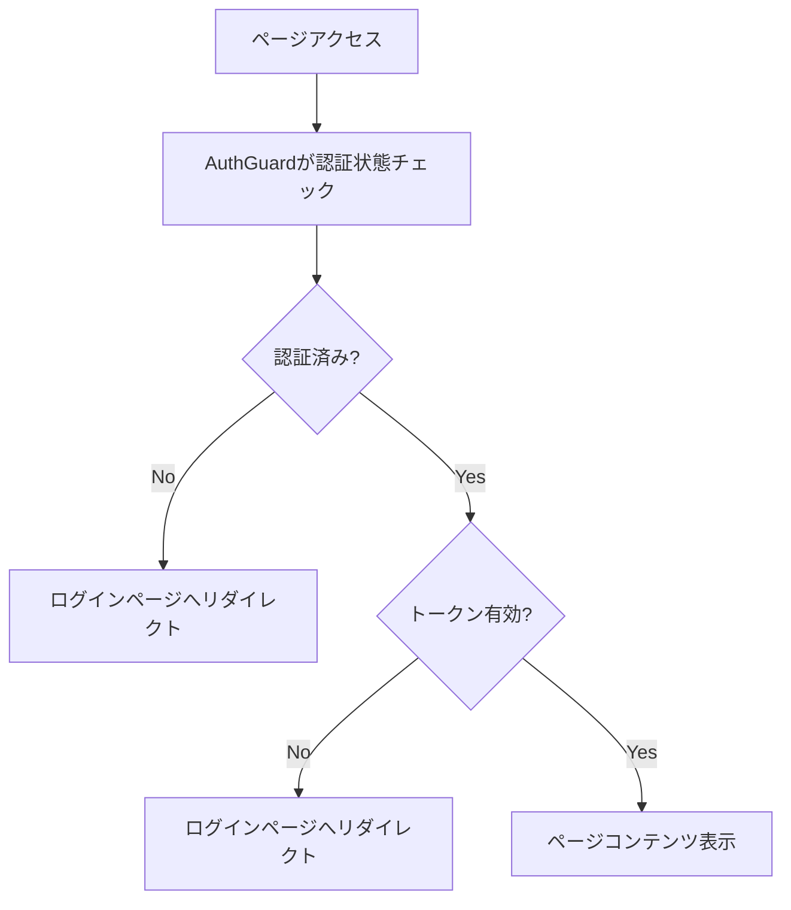

# Auth0 + NextAuth.js Authentication Implementation

このプロジェクトでは、Auth0とNextAuth.jsを使用した認証システムを実装しています。

## 🔧 実装概要

### 主要コンポーネント

| ファイル | 役割 |
|---------|------|
| `src/lib/auth.ts` | NextAuth設定とAuth0プロバイダー |
| `src/components/AuthGuard.tsx` | ページ保護コンポーネント |
| `src/hooks/useAuth.ts` | 認証状態管理フック |
| `src/components/auth/LoginButton.tsx` | ログインボタンコンポーネント |
| `src/components/auth/UserMenu.tsx` | ユーザーメニューコンポーネント |
| `src/app/login/page.tsx` | ログインページ |

## 🚀 セットアップ

### 1. 環境変数設定

`.env.local`ファイルを作成し、以下の値を設定：

```env
# NextAuth
NEXTAUTH_URL=http://localhost:3000
NEXTAUTH_SECRET=your-secret-key-here

# Auth0 Configuration
AUTH0_CLIENT_ID=your-auth0-client-id
AUTH0_CLIENT_SECRET=your-auth0-client-secret
AUTH0_ISSUER=https://your-domain.auth0.com
```

### 2. Auth0ダッシュボード設定

Auth0ダッシュボードで以下のURLを設定：

- **Allowed Callback URLs**: `http://localhost:3000/api/auth/callback/auth0`
- **Allowed Logout URLs**: `http://localhost:3000/login`
- **Allowed Web Origins**: `http://localhost:3000`

## 🔐 認証機能

### アクセストークン有効期限チェック

```typescript
// src/lib/auth.ts
callbacks: {
  async jwt({ token, account }) {
    // アクセストークンの有効期限をチェック
    if (token.expiresAt && Date.now() / 1000 > (token.expiresAt as number)) {
      console.warn("Access token has expired");
      return {};
    }
    return token;
  }
}
```

### 自動認証チェック

```typescript
// src/hooks/useAuth.ts
useEffect(() => {
  if (session?.expiresAt) {
    const checkTokenExpiry = () => {
      const currentTime = Date.now() / 1000;
      const isValid = currentTime < session.expiresAt!;
      setIsTokenValid(isValid);
    };
    // 1分ごとにトークンの有効期限をチェック
    const interval = setInterval(checkTokenExpiry, 60000);
    return () => clearInterval(interval);
  }
}, [session]);
```

## 🛡️ ページ保護

### AuthGuardの使用

```tsx
// 任意のページでの使用例
import AuthGuard from '@/components/AuthGuard'

export default function ProtectedPage() {
  return (
    <AuthGuard>
      <div>認証が必要なコンテンツ</div>
    </AuthGuard>
  )
}
```

### 保護されているページ

- トップページ (`src/app/page.tsx`)
- プロフィールページ (`src/app/profile/[id]/page.tsx`)
- プロフィール編集ページ (`src/app/profile/[id]/edit/page.tsx`)
- 作品詳細ページ (`src/app/work/[id]/page.tsx`)
- ホームページ (`src/app/home/page.tsx`)

## 🔄 認証フロー

### 1. ログイン


### 2. アクセストークン検証


## 🎯 使用方法

### ログインボタン

```tsx
import LoginButton from '@/components/auth/LoginButton'

// 基本的な使用
<LoginButton />

// カスタマイズ
<LoginButton 
  variant="primary" 
  showUserInfo={true}
  className="custom-class"
/>
```

### ユーザー情報取得

```tsx
import { useAuth } from '@/hooks/useAuth'

function MyComponent() {
  const { session, isAuthenticated, isTokenValid } = useAuth()
  
  if (!isAuthenticated) {
    return <div>ログインが必要です</div>
  }
  
  return <div>こんにちは、{session?.user?.name}さん</div>
}
```

### 認証状態の監視

```tsx
import { useAuth } from '@/hooks/useAuth'

function App() {
  const { isAuthenticated, isTokenValid } = useAuth()
  
  useEffect(() => {
    if (isAuthenticated && !isTokenValid) {
      // トークンが期限切れの場合の処理
      console.log('トークンが期限切れです')
    }
  }, [isAuthenticated, isTokenValid])
}
```

## 🐛 トラブルシューティング

### よくある問題

1. **ログインボタンを押しても同じページに戻る**
   - Auth0の設定でCallback URLが正しく設定されているか確認
   - 環境変数が正しく設定されているか確認

2. **セッションが保持されない**
   - `NEXTAUTH_SECRET`が設定されているか確認
   - ブラウザのCookieが有効になっているか確認

3. **トークンの有効期限エラー**
   - Auth0のToken Expiration設定を確認
   - セッションの更新間隔を調整

### デバッグ方法

```typescript
// 認証状態のログ出力
console.log('Current session:', {
  user: session?.user?.email,
  expiresAt: session?.expiresAt,
  isValid: isTokenValid,
  currentTime: Date.now() / 1000
})
```

## 📝 テスト

### 認証機能のテスト方法

1. **未認証状態のテスト**
   - ブラウザのDevToolsでCookieを削除
   - 保護されたページにアクセス
   - ログインページにリダイレクトされることを確認

2. **トークン期限切れのテスト**
   - DevToolsでSessionStorageを削除
   - ページをリロード
   - 再認証が促されることを確認

### テスト用ページ

`/home`ページで認証機能をテストできます。

## 🔗 関連リンク

- [NextAuth.js Documentation](https://next-auth.js.org/)
- [Auth0 Documentation](https://auth0.com/docs)
- [Auth0 NextJS SDK](https://github.com/auth0/nextjs-auth0)